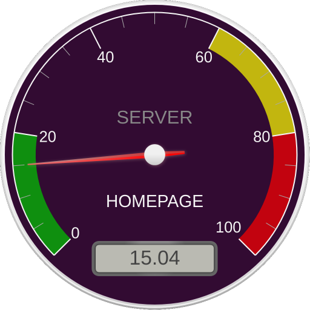
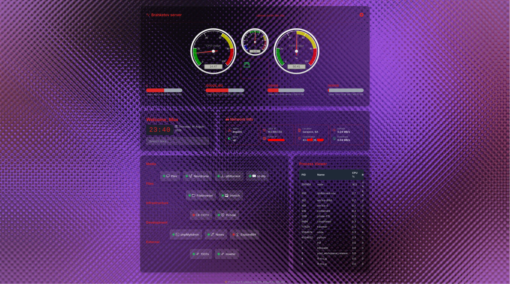
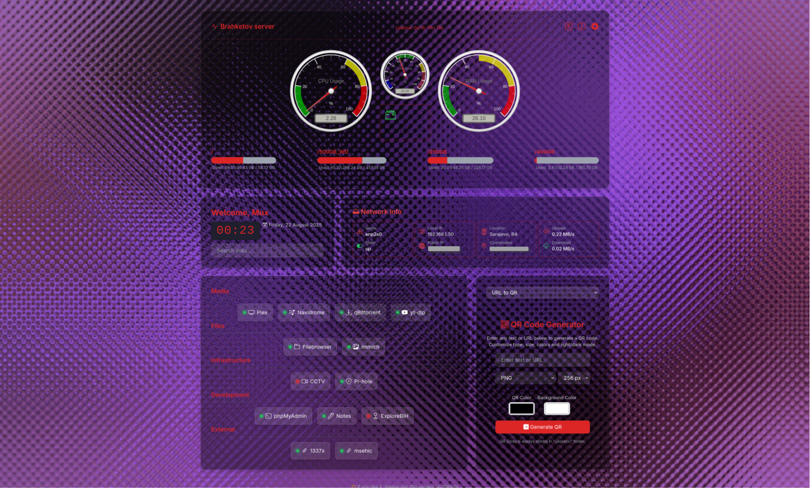
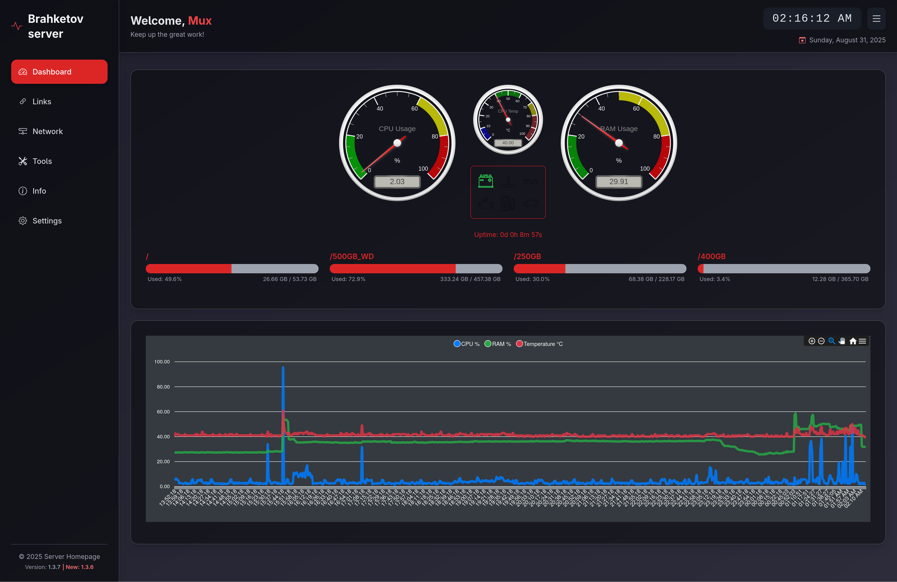
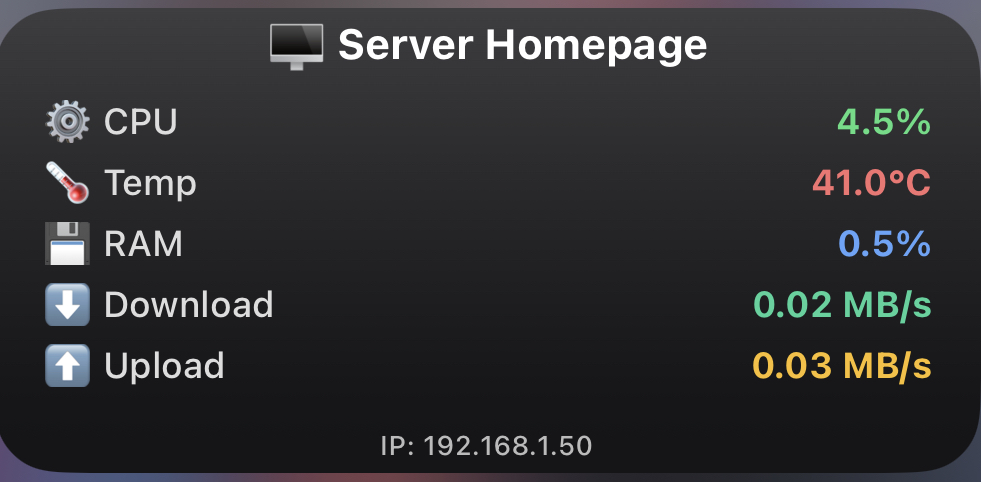

# Server Homepage

<p align="center">
  
</p>

<p align="center">
  <em>A lightweight dashboard for your home server.</em>
</p>

<p align="center">
  
  
  
  
  
  
  <a href="https://github.com/MuxBH28/server-homepage/pkgs/container/server-homepage" target="_blank">
    
  </a>
</p>

<p align="center">
   <a href="https://server-homepage.msehic.com/" target="_blank">Demo available here!</a>
</p>
<p align="center">
  
</p>

---


| Section       | Link                                  |
| --------------- | --------------------------------------- |
| About         | [Go to About](#about)                 |
| Preview       | [Go to Preview](#preview)             |
| Installation  | [Go to Installation](#installation)   |
| Arduino       | [Go to Arduino](#arduino)             |
| Scriptable    | [Go to Scriptable](#scriptable)       |
| Usage         | [Go to Usage](#usage)                 |
| Customization | [Go to Customization](#customization) |
| Author        | [Go to Author](#author)               |

---

## About

This is a minimalist personal homepage project built with **Node.js (Express)** backend and a **React + Vite** frontend styled with Tailwind CSS.

It serves system monitoring data (CPU, RAM, Disk, uptime), manages custom links via API, and shows network information.

The project is intended to be deployed on a Linux server and accessed locally or via LAN.

---

## Preview

Version 1.0:

[Release v1.0](https://github.com/MuxBH28/server-homepage/releases/tag/v1.0)

Version 1.1+:


Version 1.3.1:


Version 1.3.5:


Version 1.3.7:


## Installation
<a href="https://github.com/MuxBH28/server-homepage/pkgs/container/server-homepage" target="_blank">
    
</a>

You have three options to run **Server Homepage**: using Node.js/PM2, building from Dockerfile, or using the prebuilt Docker image. 

Cloning the repository is only necessary if you want to modify the source code.

If you get stuck or encounter any issues, feel free to reach out by creating an [issue](https://github.com/MuxBH28/server-homepage/issues) on GitHub.

### Option 1: Using Node.js / PM2

1. Make sure you have [Node.js](https://nodejs.org/) installed (version 16+ recommended).
2. Clone the repository:

```bash
git clone https://github.com/MuxBH28/server-homepage
cd server-homepage
```

3. In the project folder, install dependencies:

```bash
npm install
```

4. Start the server:

```bash
node server.js
```

or better, use [PM2](https://pm2.keymetrics.io/) to manage the process:

```bash
pm2 start server.js
```

5. Access the homepage via `http://your-server-ip:6969/` in your browser.

### Option 2: Using Dockerfile

1. Make sure you have [Docker](https://www.docker.com/get-started/) installed.
2. Clone the repository:

```bash
git clone https://github.com/MuxBH28/server-homepage
cd server-homepage
```

3. Build the Docker image:

```bash
docker build -t server-homepage .
```

4. Run the container:

```bash
docker run -d -p 6969:6969 --name server-homepage server-homepage
```

5. Access the homepage via http://your-server-ip:6969/ in your browser.

### Option 3: Using Prebuilt Docker Image

1. Make sure you have [Docker](https://www.docker.com/get-started/) installed.
2. Pull the latest image from GitHub Container Registry:

```bash
docker pull ghcr.io/muxbh28/server-homepage:latest
```

3. Run the container:

```bash
docker run -d -p 6969:6969 --name server-homepage ghcr.io/muxbh28/server-homepage:latest
```

4. Access the homepage via http://your-server-ip:6969/ in your browser.

#### Docker stop

1. To stop the container:

```bash
docker stop server-homepage
```

2. To remove the container:

```bash
docker rm server-homepage
```

---

## Arduino

### `arduino.ino` – LED Server Health Monitor

This sketch runs on an ESP32 and serves as a visual indicator of your home server's overall health. It fetches system metrics—CPU load, temperature, and RAM usage—from a REST API and uses LEDs to represent the status:

- **Green**: Normal operation
- **Yellow**: Warning thresholds
- **Red**: Critical condition
- **White blink**: Successful data fetch

The ESP32 connects to WiFi and includes error handling for network issues.
This project was created as an initial test to evaluate ESP32’s ability to communicate with the server, with future plans to expand into a wireless hub featuring a display, control buttons, and server restart functionality.

### `arduino-gauge.ino` – CPU Temperature Servo Gauge

This sketch also runs on an ESP32 but focuses solely on visualizing CPU temperature. It retrieves temperature data from the server’s REST API and drives a micro servo to move a needle across a printed gauge face.

- The gauge background (`example_of_gauge_background.png`) is designed for 180° servo rotation and can be printed for physical use.
- The needle updates every minute, and the sketch includes robust WiFi connectivity and error handling.

This setup was built to test ESP32’s ability to drive physical indicators based on server data, laying the groundwork for a compact, analog-style temperature monitor.

**Note**: It is recommended to use an external power supply for the servo motor (5VDC), with a shared ground connection to the ESP32 to ensure stable operation and avoid electrical interference.

## Scriptable

Server Homepage now includes **Scriptable widget integration**, allowing you to monitor your server’s status directly from your iOS home screen.
The widget displays key real-time metrics, including **CPU usage, RAM usage, CPU temperature, and network speeds (download & upload)**.

Detailed installation and setup instructions are available in [scriptable/instructions.md](scriptable/instructions.md).



---

## Usage

- The system info is updated automatically based on the refresh interval set in the UI.
- You can add, edit, or delete custom links through the web interface, which are saved in `links.json`.
- Weather information is fetched from a configured API and cached in localStorage for performance.

---

## Customization

### Background Image

The easiest way to change the background is to go to the settings and replace the path with your desired image. You can use a local file or an online image URL.

The default background image is:

```
./assets/background.jpg
```

One more option to change the background is to simply replace this file with your desired image, keeping the same filename and extension or in `index.html` change style of body tag.

Current default background is by [Manuela](https://pixabay.com/users/sinnesreich-2779296/?utm_source=link-attribution&utm_medium=referral&utm_campaign=image&utm_content=1759179) from [Pixabay](https://pixabay.com//?utm_source=link-attribution&utm_medium=referral&utm_campaign=image&utm_content=1759179)

### Links

Custom links are stored in `json/links.json` on the server. You can edit this file manually or use the web UI to add/remove links.

The `extra/premade-links` folder contains predefined JSON files that can be used or copied.

### Settings

Settings are stored in `json/settings.json`. You can edit them manually, but using the web UI is **recommended** to avoid errors.

### Server Port

By default, the server listens on port `6969`. You can change this by modifying the `PORT` variable in `server.js`. But before that, check [Installation](#installation) if you changed something or used Docker.

### Indicators

The dashboard includes several indicators to help monitor the server's status:

- **Battery** (./svg/battery.svg) – Shows whether the dashboard is connected to server.
- **CPU Temperature** (./svg/temperature.svg) – Lights up if the CPU temperature is high.
- **RAM Usage** (./svg/ram-high.svg) – Indicates high memory usage.
- **System Warning** (./svg/check-engine.svg) – Alerts about general system issues.
- **No Links** (./svg/no-links.svg) – Displays when there are no available links.
- **Storage** (./svg/storage.svg) – Indicates that disk storages are almost full.

The SVG icons used in this project are proudly sourced from [SVG Repo](https://www.svgrepo.com/collection/car-parts-2/) collection *Car Parts 2*.

### Widgets

The Server Homepage comes with an integrated widget system that allows you to view and interact with different information directly on the main page.
Currently available widgets:

- **Process Viewer** – Displays all active processes on the server, including PID, CPU usage, and memory.
- **Power Options** – Provides basic server commands: Shutdown, Restart, and Sleep.
- **Notes** – Allows you to keep personal notes directly on the server. All changes are saved automatically.
- **URL to QR** – Generates a QR code from any text or URL. You can customize size, colors, and download the generated QR.
- **RSS Reader** – Displays the latest articles from a selected RSS feed.
- **Crypto Prices** – Shows the current prices of popular cryptocurrencies (Bitcoin, Ethereum, and others as configured).
- **Hardware Info** – Displays detailed hardware information about the server (CPU, RAM, Storage, and more).

Widgets can be switched using the **select dropdown** at the top of the widget section. The selected widget is loaded and automatically refreshed according to configured intervals:

- Process Viewer and Crypto Prices refresh every minute or according to the configured interval.
- Notes are loaded only once, and changes are saved immediately when edited.
- RSS Reader refreshes every 10 minutes.
- Hardware info is only fetched on load.
- Power Options and URL to QR do not require automatic refreshing.

### To Do

- [ ] Improve mobile responsiveness
- [ ] Fix layout issues on smaller screens
- [ ] Optimize load time (Vite + lazy loading)
- [ ] Add loading indicators for system stats
- [ ] Improve accessibility (ARIA roles, keyboard navigation)
- [ ] Polish UI animations and transitions
- [ ] Ctrl+V to paste link
- [ ] Telegram notifications for warnings
- [ ] Background images from Immich ([ImmichFrame](https://github.com/immichFrame/ImmichFrame))

## Notes

- Ideas and suggestions are welcome! Feel free to share them by creating an [issue](https://github.com/MuxBH28/server-homepage/issues) on GitHub.
- Public network information is retrieved from [ipinfo.io](https://ipinfo.io/json).
- The available demo is provided for reference purposes and may not reflect the most recent version of the project.

---

## Author


- Created by: **MuxBH28**
- Website: [https://msehic.com](https://msehic.com)
- Email: [sehicmuhammed7@proton.me](mailto:sehicmuhammed7@proton.me)
- GitHub: [https://github.com/MuxBH28](https://github.com/MuxBH28)

---

Feel free to customize and extend the project as you like! Pull requests are very **welcome**.
If you have any questions or issues, contact me via email or GitHub.
